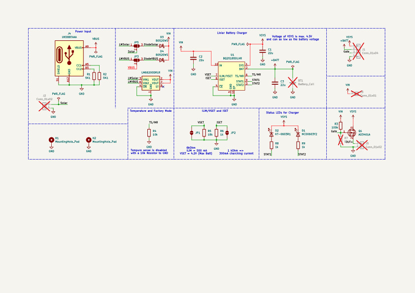
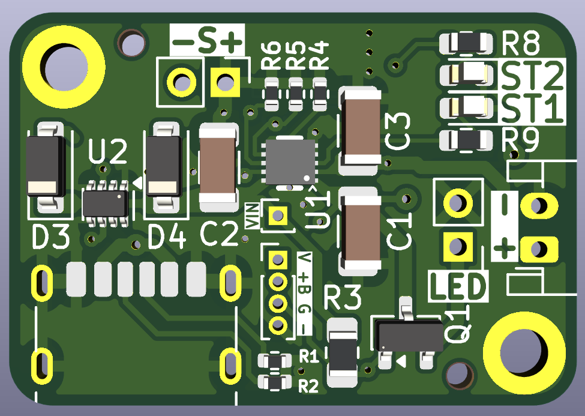
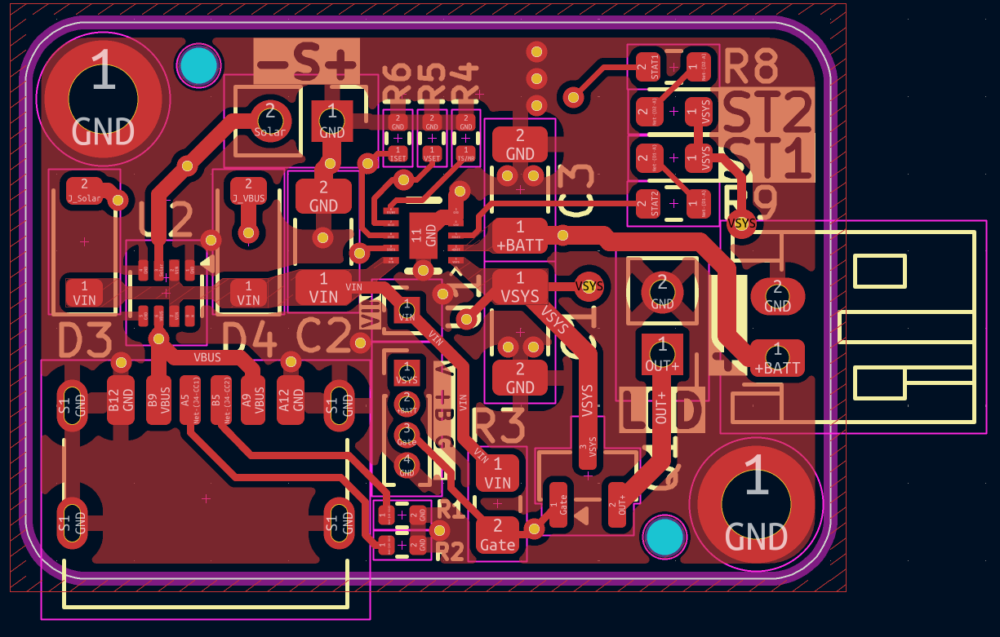
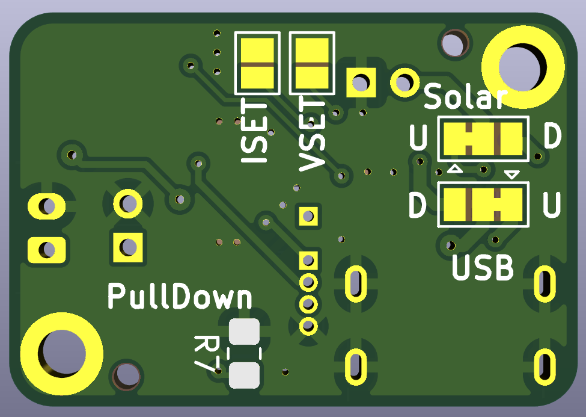
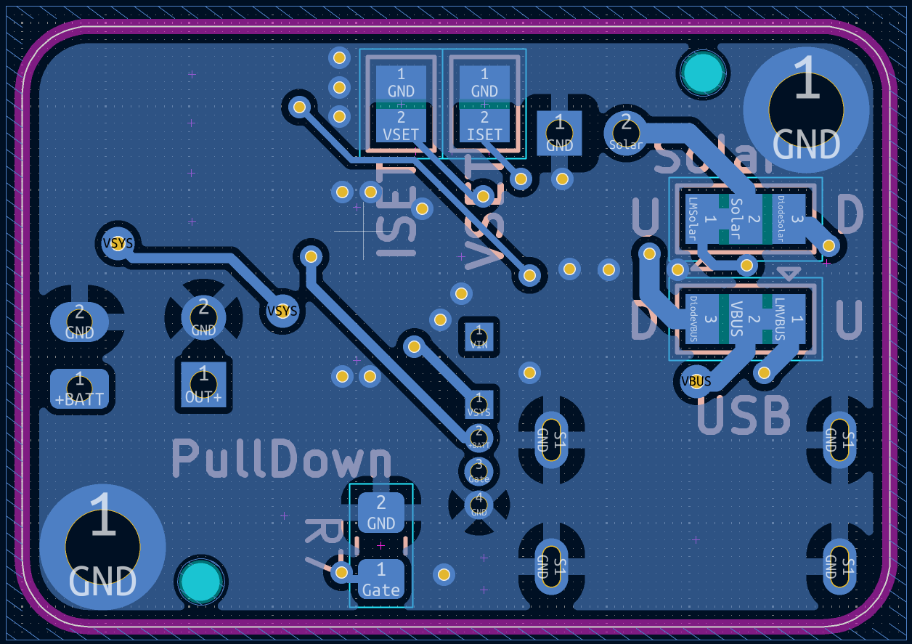

# Battery Replacer
The goal of this project is to have a solar powered lithium charger which can replace three AA Batteries in garden lamps.

This started as a project to tinker around with PCBs and have a project with a real goal. In the end i recreated a basically the [Adafruit bq25185 USB / DC / Solar Charger](https://www.adafruit.com/product/6106?srsltid=AfmBOopIVtmkb0ocQaOu4vhrrnbkDsrhC9rcjArDRcQqwAPNf7DQO3vv).

**Key points:**
* Lithium Charger for 4.2V
* MPPT for the poor man - AKA not a full implementation for MPPT but atleast something
* USB Charger
* Replace 3 AA Batteries
* Switch on if it gets dark and run until the battery under voltage protection is triggered

**Voltage & Amps:**
1. 5V á 500 mA Solar panel
2. 5V á 500 mA USB Input
3. 4.2V 500 mA Charging of Lithium Battery
4. 4.2V or lower á 1A Output

## Schematics
Main Component is a BQ25185. It checks all the points. With a 4.2V lithium battery it can also replace the 3 AA Batteries.

One special feature is the use of the LM66200, which is a "Ideal Dual-Diode" which can handle only up to 5.5V. Regarding the planed input and output voltage this device is better then diodes.

To be able to use solar panels with a voltage greater then 5V also two diodes are included. These can be activated with solder jumpers and the LM66200 needs to deactivated with the same solder jumper. See JP5 and JP3.

A different VSET and ISET can be done via the solder jumper JP1 and JP2. The existing resistor needs to be desoldered.

## PCB Design
The design should be as small as possible and have big enough components to tinker around. So it could be smaller but for me it is okay.

"-S+" is the input from the solar cells.
"LED" is the output to the garden LED light. (Voltage of the Battery of of the Input)
To the right of the LED, the Battery connector is provided.

### Front

### Back

